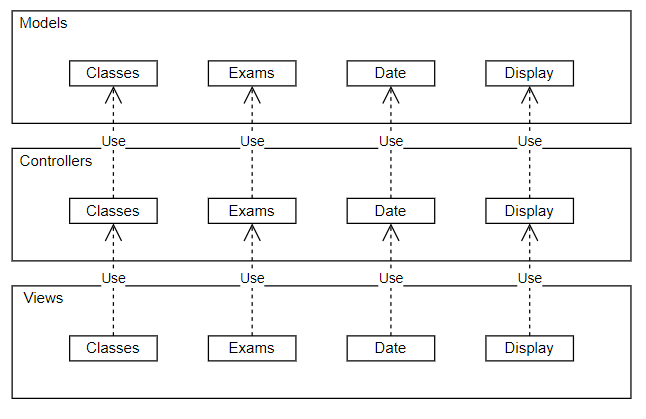

## Architecture and Design
### Logical architecture

The code follows a MVC structure, where a Model contains the corresponding data, the Controller handles user interactions using the Model, and View presents the information.
Classes, Exams, Date (date and day of the week) and Display (widget visual structure, defines the position for others) are the elements needed.

The model stores various required information regarding classes, exams and the current date.

The controller requestes information and processes received actions from the user. Both cases will be reflected on the viewer part of the widget.

The viewer displays information on the screen.

### Physical architecture

The system is composed by the **student's phone**, containing the widget, developed in *Flutter*, and its classes (models, controllers and views), and a **backend from which the information displayed** (classes and exams) **is fetched**.

### Vertical prototype

In the vertical prototype, we implemented a single page showing the app credits with the name of the members of the group. Eventhough this page won´t be in the final product, it shows we can use *Flutter* normally.

