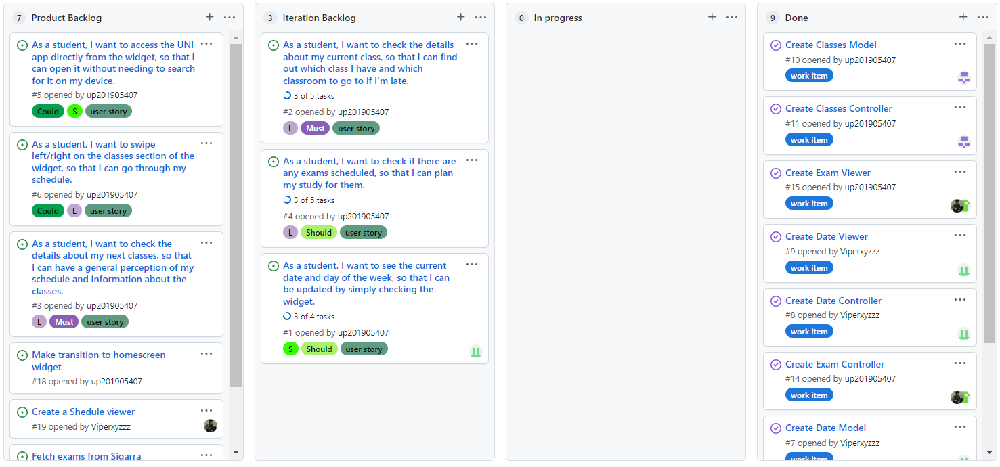
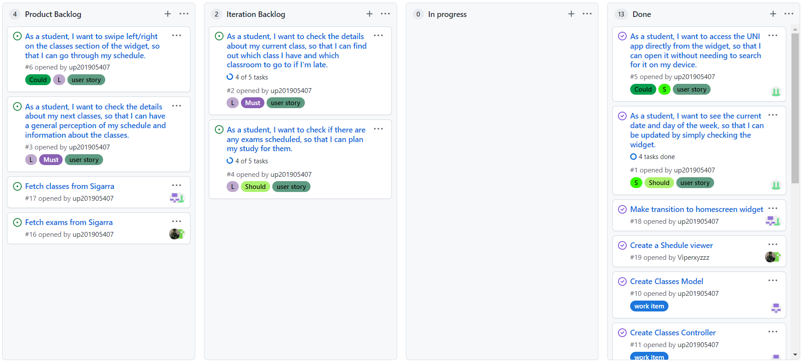
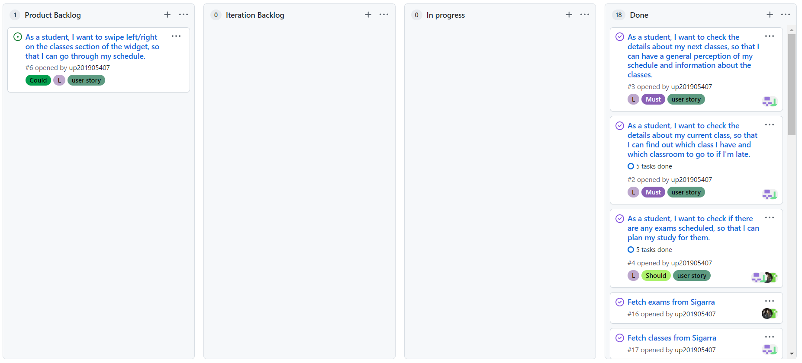

## Project management

You can find below information and references related with the project management in our team: 

* Backlog management: Product backlog and Iteration backlog in a [Github Projects board](https://github.com/LEIC-ES-2021-22/3LEIC05T6/projects/1);
* Release management: v0, [v1](https://github.com/LEIC-ES-2021-22/3LEIC05T6/releases/tag/v1.0.0), [v2](https://github.com/LEIC-ES-2021-22/3LEIC05T6/releases/tag/v2.0.0), [v3](https://github.com/LEIC-ES-2021-22/3LEIC05T6/releases/tag/v3.0.0);
* Iteration planning and retrospectives: 
  * plans: screenshots of Github Projects board at begin and end of each iteration;
  * retrospectives: meeting notes in a document in the repository
  
## Iteration planning and retrospectives

### Iteration 1
  
#### Screenshot of the board

#### What went well?
We were able to build some foundations for further development. Despite not having implemented much stuff, we took time during the first iteration to fully understand Flutter and how the UNI app project worked thus we believe that in the following iteration we will be able to implement a lot more.
#### What should we do differently?
We should split our work more evenly among the rest of the team so we can produce more efficiently.
#### What still puzzles me?
How to actually implement a homescreen widget, since little to no information about it is provided and there are a lot of constrains to what we can do using Flutter.

### Iteration 2
  
#### Screenshot of the board

#### What went well?
We were able to create the homescreen widget and pass the needed data to it. However, the data is just a mock, as we will only fetch the information from Sigarra in next iteration.
#### What should we do differently?
Overall, this iteration went as expected. For the next iteration, we can try to swap the working pairs.
#### What still puzzles me?
The data needed for this project is already being fetched in the UNI app but we need to find a way to access and use it properly, to then be sent to the homescreen widget.

### Iteration 3
  
#### Screenshot of the board

#### What went well?
We were able to 'treat' the list of classes (schedule) and the list of exams in kotlin, so the homescreen widget . However, the data is just a mock, as we will only fetch the information from Sigarra in next iteration.
#### What should we do differently?
Overall, this iteration went as expected.
#### What still puzzles me?
The data needed for this project is already being fetched in the UNI app but we need to find a way to access and use it properly, to then be sent to the homescreen widget.
