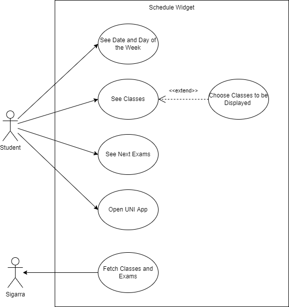
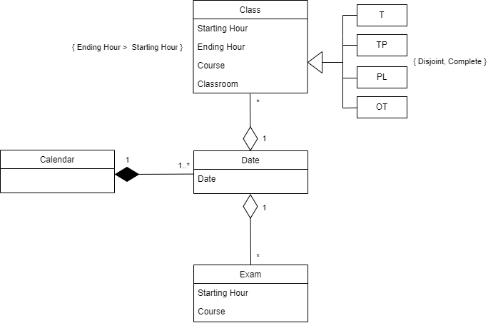

## Requirements

### Use case model 

 

  

Brief description of each use case:

|||
| --- | --- |
| *Name* | See classes |
| *Actor* | Student | 
| *Description* | The student can check his classes information, such as course name, the starting/ending time and the respective classroom. Two classes are displayed at each moment and the student can swipe to see more (the current and the next class by default). |
| *Preconditions* | - The student must be logged in. |
| *Postconditions* | - The student gets his classes information and also a general perception of their schedule for the day. |
| *Normal flow* | 1. The student swipes to the widget screen.  2. The widget displays the current class information. |
| *Alternative flow* | 1. The student swipes to the widget screen.   2. Swipes left on the widget.   3. The widget displays the next classes information. |
| *Exception* | 1. If there are no classes scheduled, the widget displays a message saying there are no current classes. |

|||
| --- | --- |
| *Name* | See date and day of the week |
| *Actor* | Student | 
| *Description* | The student can check the current date and day of the week through the widget. |
| *Postconditions* | - The student gets information about current date and day of the week. |
| *Normal flow* | 1. The student swipes to the widget screen.  2. The widget displays the current date and day of the week. |

|||
| --- | --- |
| *Name* | See next exams |
| *Actor* | Student | 
| *Description* | The student can check his next exams information, such as course name, date and the starting time. The next two exams are displayed. |
| *Preconditions* | - The student must be logged in. |
| *Postconditions* | - The student gets his next exams information and a clear display of all the exams scheduled so far. |
| *Normal flow* | 1. The student swipes to the widget screen.  2. The widget displays the next two exams. |
| *Exception* | 1. If there are no exams scheduled the widget displays a message saying there are no exams. |

|||
| --- | --- |
| *Name* | Open UNI app |
| *Actor* | Student | 
| *Description* | The student can open the UNI app by clicking on the widget. |
| *Postconditions* | - The UNI app opens on the student's device. |
| *Normal flow* | 1. The student swipes to the widget screen.  2. The student clicks on the widget (anywhere).  3. The UNI app is opened on home page. |

|||
| --- | --- |
| *Name* | Fetch Classes and Exams |
| *Actor* | Widget | 
| *Description* | The widget fetches information about students schedule and exams for further use. This information is fetched asynchronously from Sigarra once a day. |
| *Normal flow* | 1. The Sigarra system makes the information about schedules and exams available.  2. The widget fetches the information from Sigarra asynchronously. |

### User stories

[User stories available here](https://github.com/LEIC-ES-2021-22/3LEIC05T6/issues?q=is%3Aopen+is%3Aissue+label%3A%22user+story%22)

### Domain model

This widget is based on a Calendar, which is a composition of various Dates.
Each Date may have multiple Classes and Exams, but those can only belong to one Date. A Class is either "Teórica", "Teórica-Prática", "Orientação Tutorial" or "Prática Laboratorial". Exam classrooms do not take part because they are not assigned to each student directly in Sigarra (this is usually done in Moodle or by e-mail).

 

  

